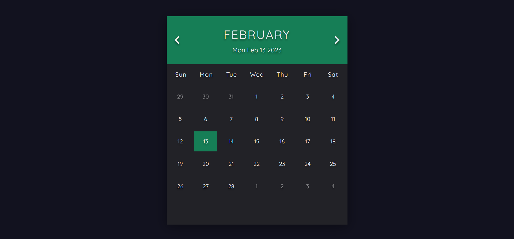

# calendar

## Description
This is a calendar application created using HTML, CSS, and JavaScript.  The current day is highlighted with a green box. At the top of the calendar the current date is displayed. The previous months or future months can be viewed by using the left and right arrows at the top of the screen to move forward through the months or back.  The JavaScript Date object is used to get the dates for the claendar.

## Demo
A demo for the project can be found here: https://tod619.github.io/calendar/